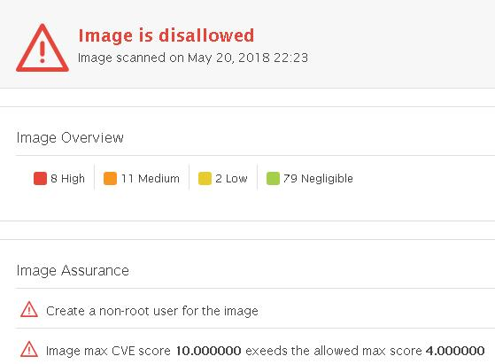
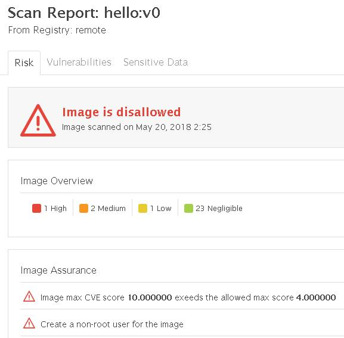
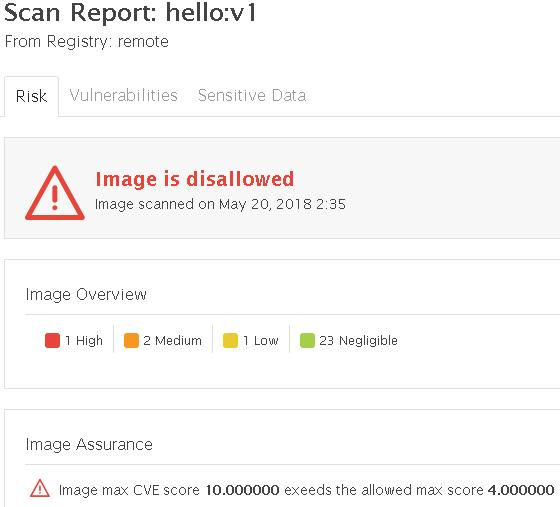
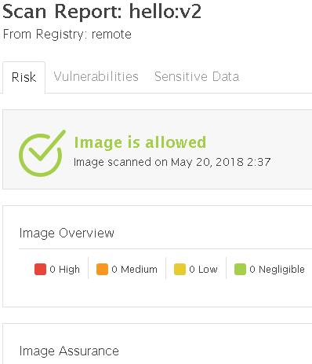

# Docker Images

The Go blog <https://blog.golang.org/docker> and 'Hello World' <https://golang.org/doc/install> are great introductions to Docker and Go.

Though 'FROM golang:onbuild’ make building images simple, Docker newbies (like me) then wonder about image size and security.  We use AquaSec scanner-cli in a POC to run some tests, realizing there are opensource and other options.

Our onbuild ‘hello world’ image is over 700MB, with vulnerabilities:

We then build various images by modifying the Dockerfile

Hello:v0 has fewer vulnerabilities (but still too many) and is now nearly 800MB.  As well our CSB policy is to not run containers as root

Hello:v1 runs as non-root, but still exceeds the acceptable vulnerability threshold

Hello:v2 passes our scan but at 378MB is still larger than necessary

We look at reducing image size using multi-stage builds in Hello2 [https://github.com/jeffbarnes769/hello2]

There are a numerous resources for securing containers, such as the CIS Benchmark [https://www.cisecurity.org/benchmark/docker/], Understanding and Hardening Linux Containers[https://www.nccgroup.trust/us/our-research/understanding-and-hardening-linux-containers] and others
