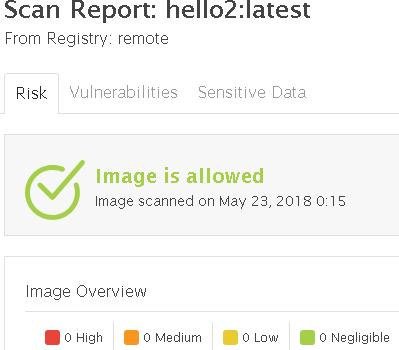

# Docker Images

The Go blog <https://blog.golang.org/docker> and 'Hello World' <https://golang.org/doc/install> are great introductions to Docker and Go.

FROM **golang:onbuild** make building images simple, though image size and security is a concern. 

$ *docker run --rm -v /var/run/docker.sock:/var/run/docker.sock --rm -v /var/run/docker.sock:/var/run/docker.sock aquasec/scanner-cli:3.0.1 scan --user username --password password --host https://tenantx-saas.aquasec.com --register --local --registry remote hello:v4 --html >> hello4.html*

(Can also be called from Jenkins or other CI/CD)

Running scanner-cli against an AquaSec SaaS tenant, containing corporate polices, produces http://htmlpreview.github.io/?https://github.com/jeffbarnes769/hello/blob/master/hello4.html

Our onbuild ‘hello world’ image is over 700MB, with vulnerabilities:

We then build various images by modifying the Dockerfile and running docker build

$ *docker run --rm -v /var/run/docker.sock:/var/run/docker.sock --rm -v /var/run/docker.sock:/var/run/docker.sock aquasec/scanner-cli:3.0.1 scan --user username --password password --host https://tenantx-saas.aquasec.com --register --local --registry remote hello:v0*

Hello:v0 has fewer vulnerabilities (but still too many) and is now nearly 800MB.  As well our CSB policy is to not run containers as root

$ *docker run --rm -v /var/run/docker.sock:/var/run/docker.sock --rm -v /var/run/docker.sock:/var/run/docker.sock aquasec/scanner-cli:3.0.1 scan --user username --password password --host https://tenantx-saas.aquasec.com --register --local --registry remote hello:v0*

Hello:v2 passes our scan but at 378MB is still larger than necessary

$ *docker run --rm -v /var/run/docker.sock:/var/run/docker.sock --rm -v /var/run/docker.sock:/var/run/docker.sock aquasec/scanner-cli:3.0.1 scan --user username --password password --host https://tenantx-saas.aquasec.com --register --local --registry remote hello:v2*

# Multi-Stage Docker Builds

Modify the Dockerfile for multi-stage docker build to reduce image size and vulnerabilities, with no change to the application code.

$ *docker build -t hello:v2 .*

Output from the AquaSec scanner-cli

$ *docker run --rm -v /var/run/docker.sock:/var/run/docker.sock --rm -v /var/run/docker.sock:/var/run/docker.sock aquasec/scanner-cli:3.0.1 scan --user username --password password --host https://tenantx-saas.aquasec.com --register --local --registry remote hello:v2*

Resources for securing containers, such as the CIS Benchmark <https://www.cisecurity.org/benchmark/docker/>, Understanding and Hardening Linux Containers <https://www.nccgroup.trust/us/our-research/understanding-and-hardening-linux-containers> and others
